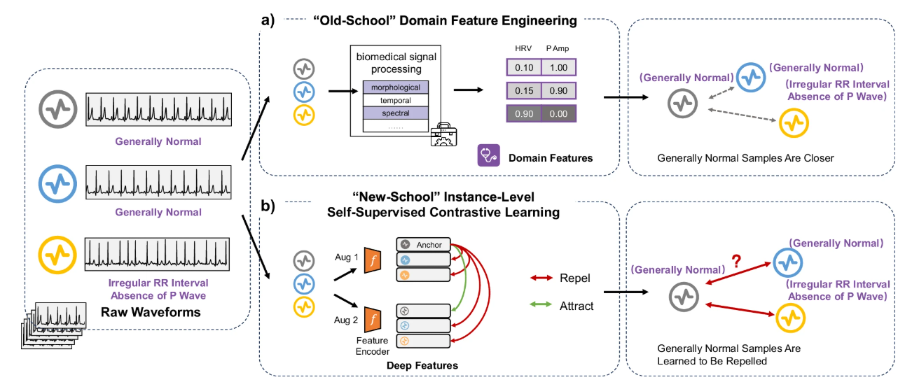

# Transforming Label-Efficient Decoding of Healthcare Wearables with Self-Supervised Learning and "Embedded" Medical Domain Expertise [](https://www.nature.com/articles/s44172-025-00467-6)
 
This repository contains code and data pipelines for training and evaluating a self-supervised contrastive learning (SSCL) framework that integrates domain knowledge for decoding healthcare wearable signals. 
Our method is built upon conventional self-supervised contrastive learning, by injecting domain knowledge ``embedded'' in conventional biomedical signal processing pipelines.


  

- **“Old-School” Domain Feature Engineering**:  
  Leverages handcrafted biomedical features (e.g., heart rate variability, P-wave amplitude) extracted via signal processing. These domain features group clinically similar samples (e.g., “generally normal”) closer together based on physiological relevance.

- **“New-School” Self-Supervised Contrastive Learning**:  
  Uses instance-level augmentation and contrastive objectives to pull different views of the same input closer while pushing others apart. However, without domain constraints, semantically similar signals may be incorrectly repelled due to a lack of semantic understanding.

> 💡 Our method bridges the gap between these two worlds by guiding SSCL using domain-knowledge-informed features, enhancing the clinical relevance and generalization ability of learned representations.


## Installation & Environment  

### Setup Instructions  
```bash
git clone https://github.com/guxiao0822/domainssl
cd domainssl
conda create -n domainssl python-3.11
conda activate domainssl
pip install -r requirements.txt
```

## Usage

Step 1: **Download and prepare the dataset**

- Download the dataset from [here](https://physionet.org/content/challenge-2017/1.0.0/).
- Preprocess the data by running the following commands:
```bash
cd datasets
python preprocess.py  # change the DATA_ROOT variable in preprocess.py to your dataset path
```

Step 2: **Run the training script**
```
# run SimCLR 
python main.py --config configs/cinc17/config_ssl_simclr.yaml
# run DomainSSL
python main.py --config configs/cinc17/config_ssl_domainssl.yaml
```

## Paper and Resources
If you find our work useful, please consider citing:
```bibtex
@article{Gu2025DomainSSL,
  title   = {Transforming label‑efficient decoding of healthcare wearables with self‑supervised learning and “embedded” medical domain expertise},
  author  = {Gu, Xiao and Liu, Zhangdaihong and Han, Jinpei and Qiu, Jianing and Fang, Wenfei and Lu, Lei and Clifton, Lei and Zhang, Yuan‑Ting and Clifton, David A.},
  journal = {Communications Engineering},
  year    = {2025},
  volume  = {4},
  number  = {135},
  doi     = {10.1038/s44172-025-00467-6},
  url     = {https://www.nature.com/articles/s44172-025-00467-6}
}
```


